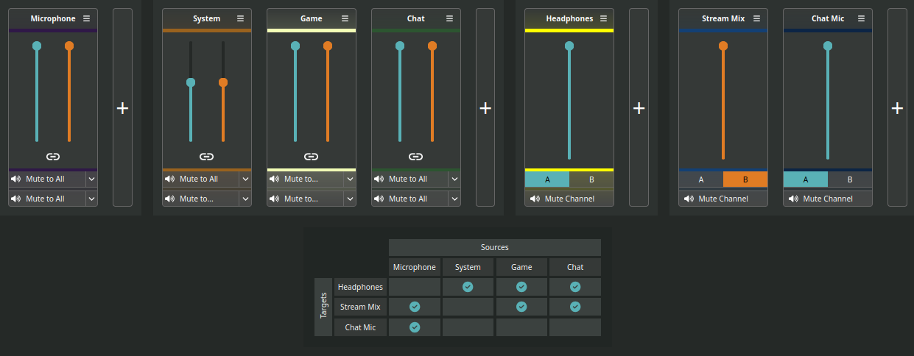

# PipeWeaver

**PipeWeaver** is an audio management tool for Linux built on top of [PipeWire](https://pipewire.org), designed
specifically with streaming and broadcasting in mind. Join us on [Discord](https://discord.gg/gKVREmSwTh).

****

### This project is still in heavy development.

PipeWeaver is in active development, and my not yet be usable for everyone on a daily basis. There are definitely
still some issues, and a lack of configuration for tuning that may make life a little difficult! It should, however
be stable enough to check out and play with.

Also note, that until I'm doing 'formal' releases changes to code may reset your settings. You have been warned!
****

PipeWeaver is an attempt to bring a simple way to manage complex streaming audio setups, it allows creation of virtual
audio sources, attaching physical audio sources, managing volumes (including matrix mixing), 'complex' mute
arrangements, and finally routing to physical and virtual outputs.

This readme is a work in progress, so details are a little on the slim side at the moment!

Configuration is done via a simple Web Page in your
browser ([reasoning here](https://github.com/pipeweaver/pipeweaver/wiki/Why-a-Web-Page%3F)) to allow you to access the
UI from wherever you may need it. An API is also available, allowing other devices to communicate and control audio.

****

## Getting Started

**NOTE**: We highly recommend Pipewire 1.4.0 and above, during development we encountered some strange latency issues,
especially when UCM devices were in the routing tree, these seem to have been solved in 1.4.0.

### Building

There are currently no builds available, so you'll have to do it yourself for now. The instructions are pretty simple.

Firstly, ensure you have rust (and cargo) installed, as well as pipewire.

1) Check out the repository
2) Run `cargo build --release`
3) Grab the `pipeweaver-daemon` binary from `target/release/`
4) Run it (probably in a terminal, but you can also manually configure it to autostart).
5) PipeWeaver will then create a 'Default' layout, with some nodes pre-routed
6) The configuration UI will be available at http://localhost:14565

When you shut down pipeweaver, all the nodes and routes will be automatically removed.

****

## Current Status

Planned but not yet implemented:

* Channel Re-ordering
* Tray Icon and .desktop Files
* Custom Channel Colours
* A 'Tablet Mode' interface
* Multiple Profile Support
* Latency Tuning
* Useful Documentation
* Channel Metering

Potential Features:

* Application Management (Move Applications to channels inside the UI)
* LV2 support for Mic Effects (Gate, Compressor, Expander, Eq etc)
* flatpak support

****
Finally, a shout-out to [SonusMix](https://codeberg.org/sonusmix/sonusmix), their pipewire implementation
served as heavy inspiration for my own!